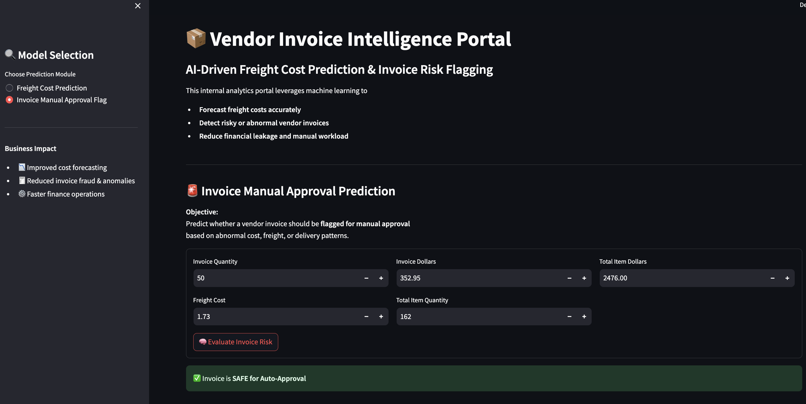

# 🧾 SmartInvoice ML — Freight Estimation & Invoice Risk Detection

> An intelligent machine learning pipeline that helps finance and procurement teams predict freight costs and automatically surface high-risk vendor invoices before they create financial leakage.

---

## Overview

Vendor invoice management at scale is error-prone and resource-intensive. This project tackles two core pain points faced by finance operations teams:

- **Freight cost overruns** — by building a regression model that estimates expected freight before an invoice is processed.
- **Invoice anomalies slipping through** — by training a classifier to flag invoices that deviate from normal cost, freight, or delivery behavior.

The result is a deployable Streamlit application that provides real-time predictions with human-readable explanations.

---

## Why This Was Built

| Problem | Consequence | ML Solution |
|---|---|---|
| Freight costs are inconsistently estimated | Budget overruns, poor margin tracking | Regression model trained on historical invoice data |
| Manual invoice review doesn't scale | Audit gaps, financial leakage | Binary classifier to surface anomalous invoices |
| Late-stage detection of billing issues | Limited negotiation window with vendors | Real-time predictions at invoice entry |

---

## Data Architecture

All data lives in a local SQLite database (`inventory.db`). Features are engineered at the **invoice level** by aggregating across four relational tables:

```
inventory.db
├── vendor_invoice      ← Invoice-level financials & timestamps
├── purchases           ← Line-item purchase records
├── purchase_prices     ← Reference pricing data
├── begin_inventory     ← Opening inventory snapshots
└── end_inventory       ← Closing inventory snapshots
```

SQL joins and aggregations are used to construct a flat feature table suitable for ML training.

---

## Analysis Highlights

Before modeling, exploratory analysis was conducted to validate business assumptions:

- Flagged invoices were statistically tested (t-tests) to confirm they carry higher financial exposure than normal invoices
- Freight cost scaling with quantity was examined — both linearly and non-linearly
- Vendor-level behavioral patterns were extracted to improve feature quality

---

## Modeling Approach

### Task 1 — Freight Cost Prediction (Regression)

| Model | Role |
|---|---|
| Linear Regression | Baseline |
| Decision Tree Regressor | Intermediate |
| **Random Forest Regressor** | **Final model** |

**Evaluation metrics:** MAE · RMSE · R²

---

### Task 2 — Invoice Risk Flagging (Classification)

| Model | Role |
|---|---|
| Logistic Regression | Baseline |
| Decision Tree Classifier | Intermediate |
| **Random Forest Classifier + GridSearchCV** | **Final model** |

GridSearchCV is used with F1-score as the optimization target to handle class imbalance in flagged invoices.

**Evaluation metrics:** Accuracy · Precision · Recall · F1-score · Feature Importance

---

## Application

A Streamlit front-end wraps the full pipeline into an interactive tool:

- Enter invoice details (quantity, vendor, value, etc.)
- Get an estimated freight cost instantly
- See whether the invoice is flagged as high-risk
- Understand *why* the model flagged it via feature-level explanations




---

## Project Layout

```
smartinvoice-ml/
│
├── data/
│   └── inventory.db                    # SQLite database
│
├── freight_cost_prediction/
│   ├── data_preprocessing.py
│   ├── model_evaluation.py
│   └── train.py
│
├── invoice_flagging/
│   ├── data_preprocessing.py
│   ├── model_evaluation.py
│   └── train.py
│
├── inference/
│   ├── predict_freight.py
│   └── predict_invoice_flag.py
│
├── models/
│   ├── predict_freight_model.pkl       # Trained regression model
│   ├── scaler.pkl                      # Feature scaler
│   └── predict_flag_invoice.pkl        # Trained classifier
│
├── notebooks/
│   ├── Invoice Flagging.ipynb
│   └── Predict Freight Cost.ipynb
│
├── app.py                              # Streamlit application
├── README.md
└── .gitignore
```

---

## Getting Started

**1. Clone the repository**
```bash
git clone https://github.com/yourusername/smartinvoice-ml.git
cd smartinvoice-ml
```

**2. Train and persist the models**
```bash
python freight_cost_prediction/train.py
python invoice_flagging/train.py
```

**3. Validate model inference**
```bash
python inference/predict_freight.py
python inference/predict_invoice_flag.py
```

**4. Launch the Streamlit app**
```bash
streamlit run app.py
```

---

## Tech Stack

- **Python** — core language
- **scikit-learn** — model training, evaluation, and tuning
- **SQLite / pandas** — data storage and feature engineering
- **Streamlit** — application layer
- **Jupyter Notebooks** — exploratory analysis

---

## Author

Built with the goal of making invoice operations smarter, faster, and more auditable.  
Feel free to reach out for questions, feedback, or collaboration opportunities.


